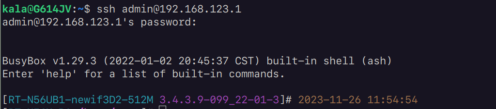
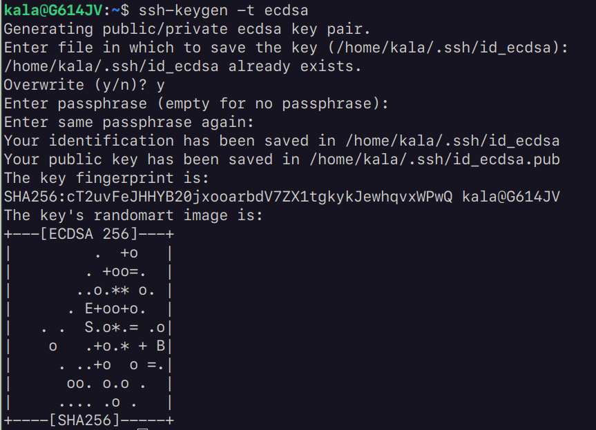
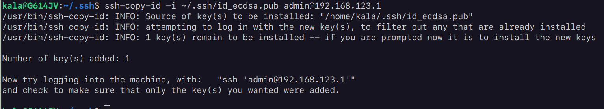
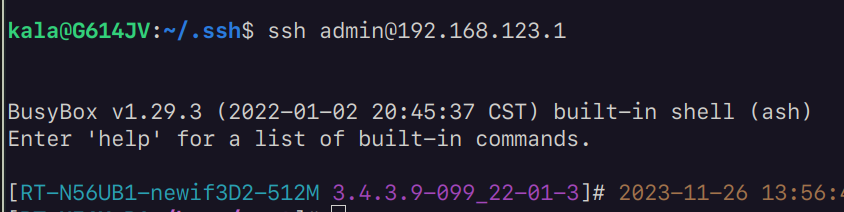

1. make sure the SSH function is available and enable on the remote device.\
   

2. try to use ssh to login (still need password), make sure you can login properly, in my case:\
   `ssh admin@192.168.123.1`\
   

3. generate the ssh-key by typing the command (I have no idea why my router only accepts ecdsa):\
   `ssh-keygen -t ecdsa`\
   

4. exit to local shell and type (it might need you to type the password in this step.):\
   `ssh-copy-id -i ~/.ssh/id_ecdsa.pub admin@192.168.123.1`\
   

5. login without password\
   
