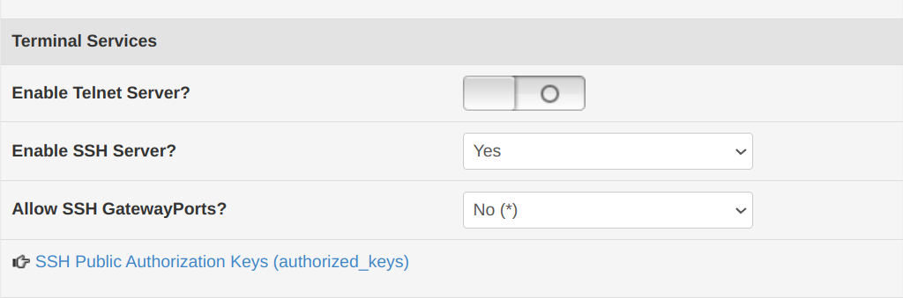

1. make sure the SSH function is available and enabled on the remote device. \
   

2. try to use ssh to log in (still need password), make sure you can log in properly, in my case:\
   `kala@G614JV:~$ ssh admin@192.168.123.1`
   
   >`BusyBox v1.29.3 (2022-01-02 20:45:37 CST) built-in shell (ash)`\
   >`Enter 'help' for a list of built-in commands.`\
   >`[RT-N56UB1-newif3D2-512M 3.4.3.9-099_22-01-3]# 2023-11-26 16:58:34`\
   `[RT-N56U_B1 /home/root]#`

4. generate the ssh-key by typing the command (I have no idea why my router only accepts ecdsa):\
   `kala@G614JV:~$ ssh-keygen -t ecdsa`

5. exit to the local shell and type (it might need you to type the password in this step.):\
   `kala@G614JV:~$ ssh-copy-id -i ~/.ssh/id_ecdsa.pub admin@192.168.123.1`
   
   >`/usr/bin/ssh-copy-id: INFO: Source of key(s) to be installed: "/home/kala/.ssh/id_ecdsa.pub"`\
   >`/usr/bin/ssh-copy-id: INFO: attempting to log in with the new key(s), to filter out any that are already installed`\
   >`/usr/bin/ssh-copy-id: INFO: 1 key(s) remain to be installed -- if you are prompted now it is to install the new keys`\
   >`Number of key(s) added: 1`\
   >`Now try logging into the machine, with:   "ssh 'admin@192.168.123.1'"`\
   >`and check to make sure that only the key(s) you wanted were added.`

6. login without password\
   `kala@G614JV:~$ ssh admin@192.168.123.1`
   
   >`BusyBox v1.29.3 (2022-01-02 20:45:37 CST) built-in shell (ash)`\
   >`Enter 'help' for a list of built-in commands.`\
   >`[RT-N56UB1-newif3D2-512M 3.4.3.9-099_22-01-3]# 2023-11-26 16:58:34`\
   `[RT-N56U_B1 /home/root]#`
